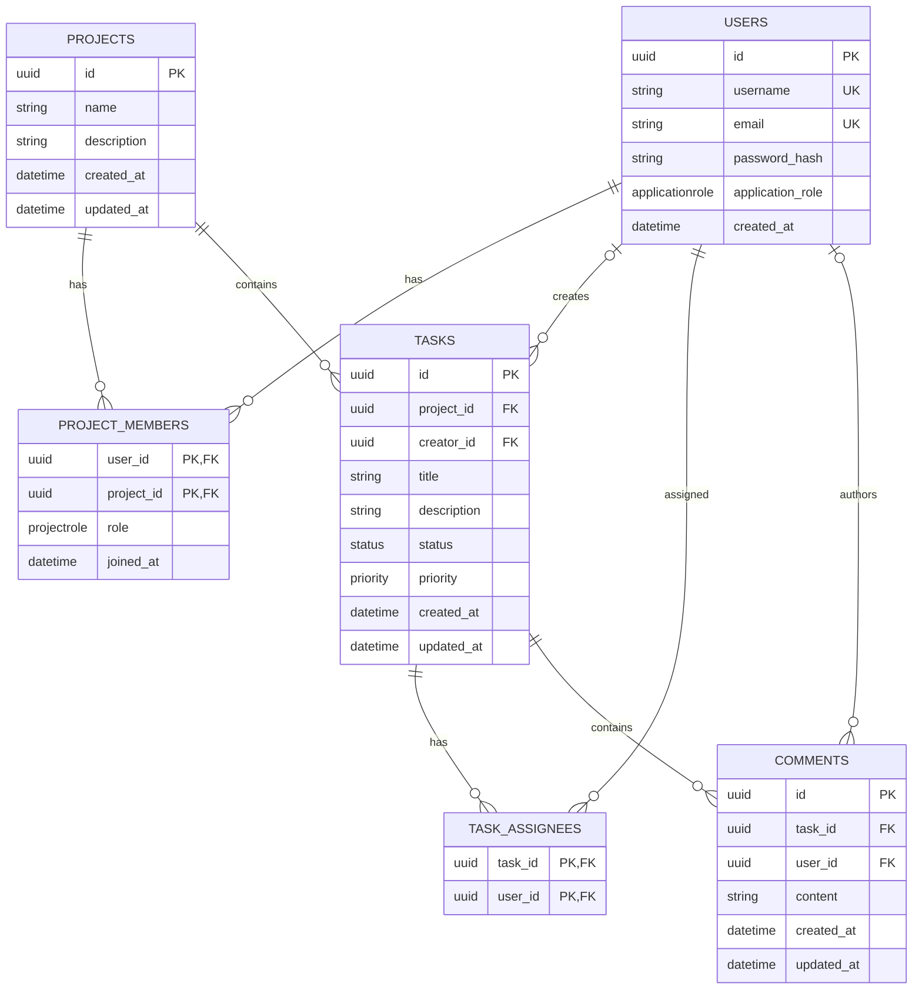

# Database Design

## Overview

The application uses PostgreSQL with SQLAlchemy models and Alembic migrations.
Two association tables represent many-to-many relationships:

- `project_members` connects users to projects and stores the user's project role.
- `task_assignees` connects users to tasks without additional assignment attributes.

Entity primary keys use UUIDs generated by the application with `uuid4`.

## Relationship Diagram

`tasks.creator_id` and `comments.user_id` are nullable foreign keys, so a task or comment can remain when its associated user is deleted.

## Tables

### `users`

Stores application users and their application-level role.

| Column | Type | Nullability | Constraints |
| --- | --- | --- | --- |
| `id` | UUID | Not null | Primary key; generated with `uuid4` |
| `username` | String | Not null | Unique |
| `email` | String | Not null | Unique |
| `password_hash` | String | Not null |  |
| `application_role` | Enum | Not null | `ADMIN`, `USER` |
| `created_at` | Timezone-aware datetime | Not null |  |

### `projects`

Stores project records.

| Column | Type | Nullability | Constraints |
| --- | --- | --- | --- |
| `id` | UUID | Not null | Primary key; generated with `uuid4` |
| `name` | String | Not null |  |
| `description` | String | Nullable |  |
| `created_at` | Timezone-aware datetime | Not null |  |
| `updated_at` | Timezone-aware datetime | Not null |  |

The project creator is represented by a `project_members` row with the `MANAGER` role; `projects` does not contain a separate creator foreign key.

### `project_members`

Associates users with projects and stores their project-specific role.

| Column | Type | Nullability | Constraints |
| --- | --- | --- | --- |
| `user_id` | UUID | Not null | Part of composite primary key; foreign key to `users.id` |
| `project_id` | UUID | Not null | Part of composite primary key; foreign key to `projects.id` |
| `role` | Enum | Not null | `MANAGER`, `MEMBER` |
| `joined_at` | Timezone-aware datetime | Not null |  |

The composite primary key prevents duplicate memberships for the same user and project.

### `tasks`

Stores tasks belonging to projects.

| Column | Type | Nullability | Constraints |
| --- | --- | --- | --- |
| `id` | UUID | Not null | Primary key; generated with `uuid4` |
| `project_id` | UUID | Not null | Foreign key to `projects.id` |
| `creator_id` | UUID | Nullable | Foreign key to `users.id` |
| `title` | String | Not null |  |
| `description` | String | Nullable |  |
| `status` | Enum | Not null | `TODO`, `IN_PROGRESS`, `DONE` |
| `priority` | Enum | Not null | `LOW`, `MEDIUM`, `HIGH` |
| `created_at` | Timezone-aware datetime | Not null |  |
| `updated_at` | Timezone-aware datetime | Not null |  |

### `task_assignees`

Associates users with tasks as assignees.

| Column | Type | Nullability | Constraints |
| --- | --- | --- | --- |
| `task_id` | UUID | Not null | Part of composite primary key; foreign key to `tasks.id` |
| `user_id` | UUID | Not null | Part of composite primary key; foreign key to `users.id` |

The composite primary key prevents assigning the same user to the same task more than once.

### `comments`

Stores comments attached to tasks.

| Column | Type | Nullability | Constraints |
| --- | --- | --- | --- |
| `id` | UUID | Not null | Primary key; generated with `uuid4` |
| `task_id` | UUID | Not null | Foreign key to `tasks.id` |
| `user_id` | UUID | Nullable | Foreign key to `users.id` |
| `content` | String | Not null |  |
| `created_at` | Timezone-aware datetime | Not null |  |
| `updated_at` | Timezone-aware datetime | Not null |  |

## Constraints and Indexes

### Foreign keys and deletion behavior

| Foreign key | `ON DELETE` behavior | Effect |
| --- | --- | --- |
| `project_members.user_id` -> `users.id` | `CASCADE` | Deleting a user removes that user's project memberships. |
| `project_members.project_id` -> `projects.id` | `CASCADE` | Deleting a project removes its memberships. |
| `tasks.project_id` -> `projects.id` | `RESTRICT` | A project with tasks cannot be deleted. |
| `tasks.creator_id` -> `users.id` | `SET NULL` | Deleting a task creator preserves the task and clears `creator_id`. |
| `task_assignees.task_id` -> `tasks.id` | `CASCADE` | Deleting a task removes its assignments. |
| `task_assignees.user_id` -> `users.id` | `CASCADE` | Deleting a user removes that user's assignments. |
| `comments.task_id` -> `tasks.id` | `CASCADE` | Deleting a task removes its comments. |
| `comments.user_id` -> `users.id` | `SET NULL` | Deleting a comment author preserves the comment and clears `user_id`. |

### Unique constraints

The `users` table has unique constraints on `username` and `email`. The association tables enforce uniqueness through their composite primary keys.

### Indexes

The implemented schema includes these non-primary-key indexes:

- `project_members.project_id`
- `tasks.project_id`
- `tasks.creator_id`
- `task_assignees.user_id`
- `comments.task_id`

These indexes support lookups of memberships by project, tasks by project or creator, task assignments by user, and comments by task. Primary keys and unique constraints are also backed by indexes in PostgreSQL.